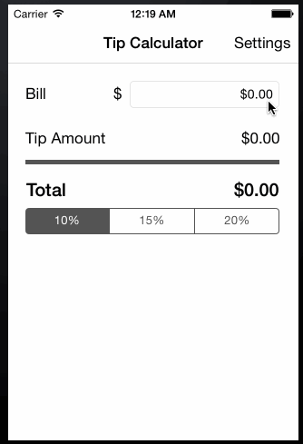

# Tip Calculator 

This is the Prework iOS application for a Tip Calculator.  This application was build following the walk-through [Instructions](https://courses.codepath.com/snippets/intro_to_ios/thanks_for_applying#heading-prework) and [Hints](https://gist.github.com/timothy1ee/7747214).

Time spent: 8 hours spent in total

Completed user stories:

 * [x] Required: Complete Video Walk Through
 * [x] Required: Settings Page
 * [x] Optional: Remember the bill amount across app restarts
 * [x] Optional: Use locale specific currency and currency thousands separators
 * [x] Optional: Add a light/dark color theme to the settings view
 * [x] Optional: Added a status label that will animate (fade-in/fade-out) a message to congratulate 'good tippers'

Spent more time than expected on conforming input on UITextFields.  This required me to try and understand 'UITextFieldDelegate'.  Also got stuck trying to properly set constaints on UI objects within the Interface Builder.

Walkthrough of all user stories:

